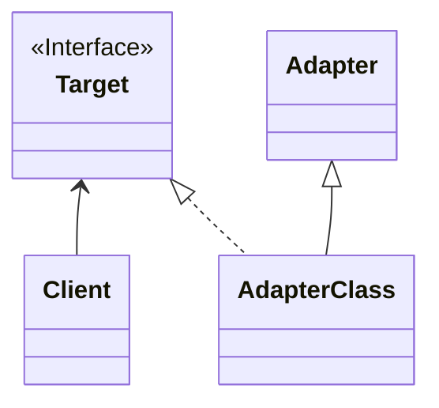

### 适配器模式优点

* 将目标类和适配者类解耦
* 增加了类的透明性和复用性
* 灵活性和扩展性好

### 适配器模式结构

* `Target`：目标角色(所期待得到的接口)
* `Adapter`：适配器类
* `Adaptee`：适配者类(现在需要适配的接口)
* `Client`：客户类

```mermaid
classDiagram
class Client
class Target{
	<<Interface>>
}
class AdapterClass
class Adapter
Target <-- Client
Target <|.. AdapterClass
Adapter <|-- AdapterClass
```

