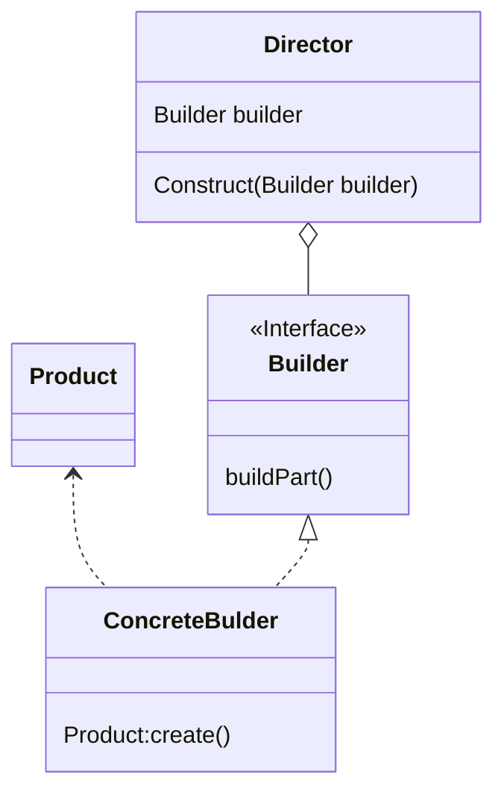

#### 1.with建造者模式

```kotlin
val pen = Pen()
//通过with来实现
with(pen,{
    color = "red"
    width = 2f
    roound = true
})
pen.write()

//使用引入对象，并使用lambda表达式的返回结果
val numbers = mutableListof("1","2","3")
val result = with(numbers){
    "The first element is ${first()},"+
    		"the last element is${last()}"
}
println(result)
```


#### 2.apply建造者模式

```kotlin
pen.apply{
    color = "gray"
    width = 6f
    round = false
    wr
}
```

