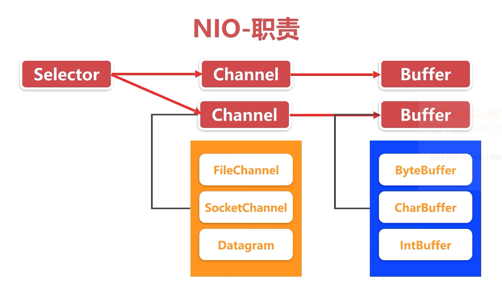

#### NIO职责

#### Selector注册事件

* `SelectionKey.OP_CONNECT` 连接就绪
* `SelectionKey.OP_ACCEPT` 接收就绪 有新的客户端到了
* `SelectionKey.OP_READ` 读就绪 有新的消息到了
* `SelectionKey.OP_WRITE`写就绪

#### Selector使用流程

* `open()`开启一个选择器,可以给注册器注册需要关注的事件
* `register()`将一个`Channel`注册到选择器,当选择器触发对应关注事件时回调到`Channel`中，处理相关数据
* `select()/selectNow()`一个通道`Channel`,处理一个当前的可用、待处理的通道数据
* `selectedKeys()`的到当前就绪的通道
* `wakeUp()`唤醒一个处于select状态的选择器
* `close()`关闭一个选择器,注销所有关注的事件

#### Selector注意事项

* 注册到选择器的通道必须为非阻塞状态
* `FileChannel`不能用于`Selector`，因为`FileChannel`不能切换为非阻塞模式；套接字通道可以

#### Selector SelectionKey

* `Interest`集合：可读可写状态
* `Ready`集合 ：就绪状态
* `Channel`通道
* `Selector` 选择器
* `obj` 附加值