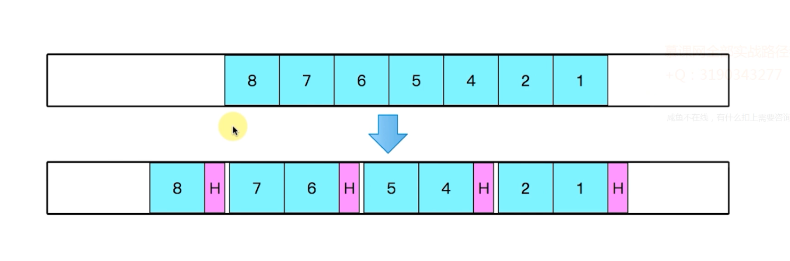

#### 文件传输与普通传输区别

* 最大的差别：文件数据bytes远远大于普通数据bytes
* 文件传输需分片，组装分片
* 文件传输如何中途取消而不影响后续的Packet发送
* 文件传输校验、保证数据准确性

#### 普通数据操作流程

#### 文件数据分片

#### 文件消息模型基础实现

* `Packet`改成流传输
* `IoArgs`改成流输入输出
* `Dispatcher`调度逻辑调整

