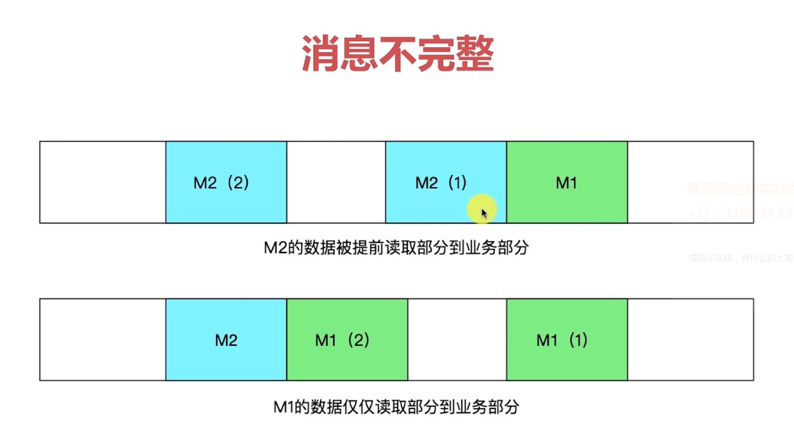

#### TCP

* TCP本质上并不会发送数据层面的粘包
* TCP的发送方与接收方一定会确保数据是以一种有序的方式到达客户端
* 并且会确保数据包完整

#### UDP

* `UDP`不保证消息完整性，所以`UDP`往往发生丢包等情况
* `TCP`数据传输具有：顺序性、完整性
* 在常规所说`Socket`"粘包"，并非数据传输层面粘包
* "粘包"是数据处理的逻辑层面上发生的粘包
* 这里所说的"粘包"：包含`TCP`、`UDP`甚至其他任意的数据流交互方案
* `Mina`、`Netty`等框架从根本来说也是为了解决粘包而设计的高并发库

* 从数据的传输层面来讲`TCP`也不会发生数据丢失不全等情况
* 一旦出现一定是`TCP`停止运行终止之时
* "数据不完整"依然针对的是数据的逻辑接收层面
* 在物理传输层面来讲数据一定是能安全的完整的送达另一端
* 但另一端可能缓冲区不够或者数据处理上不够完整导致数据只能读取一部分数据
* 这种情况称为"数据不完整" "数据丢包"等

#### 复现消息传输错误

* 多消息粘包
* 单消息不完整
* 消息到达提醒重复触发（读消息时未设置取消监听）