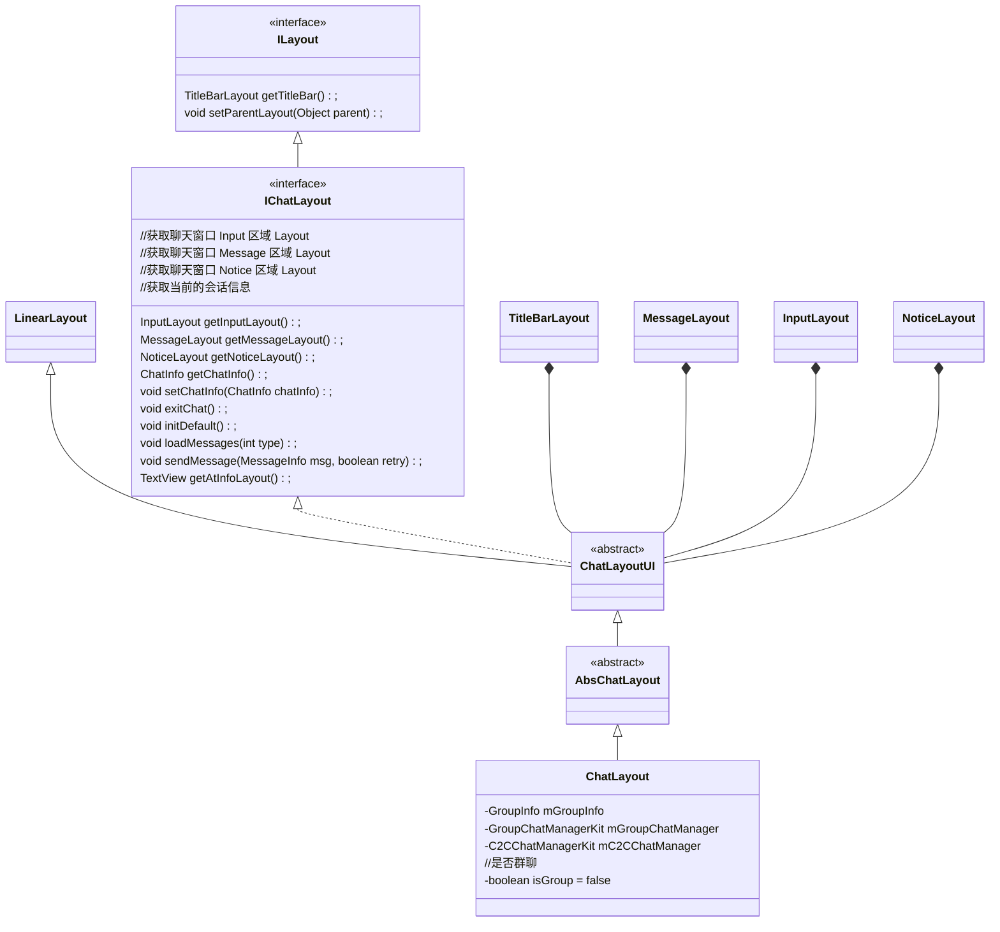
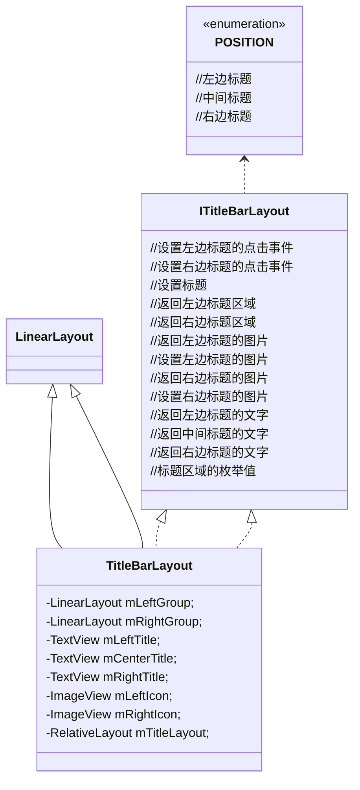
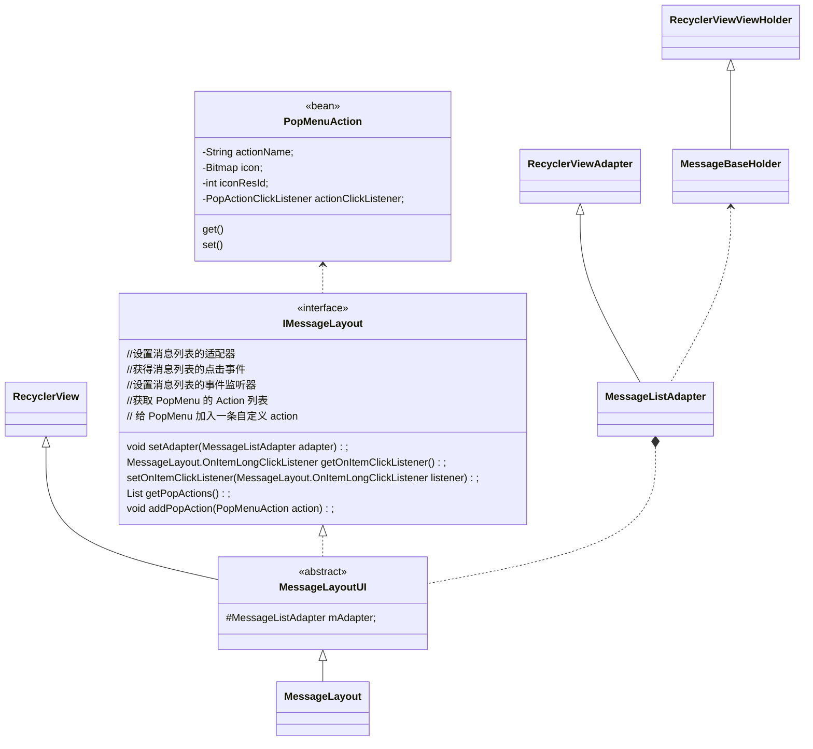
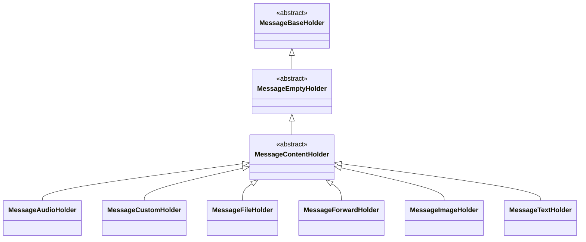

#### 聊天UML

```mermaid
classDiagram
class ChatLayout{
	-GroupInfo mGroupInfo
	-GroupChatManagerKit mGroupChatManager
	-C2CChatManagerKit mC2CChatManager
	//是否群聊
	-boolean isGroup = false 
}

class AbsChatLayout{
	<<abstract>>
}

class ChatLayoutUI{
	<<abstract>>
}

class ILayout{
	<<interface>>
	TitleBarLayout getTitleBar();
	 void setParentLayout(Object parent);
}
class IChatLayout{
	<<interface>>
	//获取聊天窗口 Input 区域 Layout
	 InputLayout getInputLayout();
	 //获取聊天窗口 Message 区域 Layout
	 MessageLayout getMessageLayout();
	 //获取聊天窗口 Notice 区域 Layout
	 NoticeLayout getNoticeLayout();
	 //获取当前的会话信息
	 ChatInfo getChatInfo();
	 void setChatInfo(ChatInfo chatInfo);
	 void exitChat();
	 void initDefault();
	 void loadMessages(int type);
	 void sendMessage(MessageInfo msg, boolean retry);
	  TextView getAtInfoLayout();
}
class LinearLayout

class TitleBarLayout
class MessageLayout
class InputLayout
class NoticeLayout

LinearLayout <|-- ChatLayoutUI
ILayout <|-- IChatLayout
IChatLayout <|.. ChatLayoutUI
TitleBarLayout *-- ChatLayoutUI
MessageLayout *-- ChatLayoutUI
InputLayout *-- ChatLayoutUI
NoticeLayout *-- ChatLayoutUI

ChatLayoutUI <|-- AbsChatLayout
AbsChatLayout <|-- ChatLayout
```

##### TitleBarLayout

```mermaid
classDiagram
class LinearLayout

class TitleBarLayout{
	-LinearLayout mLeftGroup;
    -LinearLayout mRightGroup;
    -TextView mLeftTitle;
    -TextView mCenterTitle;
    -TextView mRightTitle;
    -ImageView mLeftIcon;
    -ImageView mRightIcon;
    -RelativeLayout mTitleLayout;
}

class ITitleBarLayout{
	//设置左边标题的点击事件
	//设置右边标题的点击事件
	//设置标题
	//返回左边标题区域
	//返回右边标题区域
	//返回左边标题的图片
	//设置左边标题的图片
	//返回右边标题的图片
	//设置右边标题的图片
	//返回左边标题的文字
	//返回中间标题的文字
	//返回右边标题的文字
	//标题区域的枚举值
}

class POSITION{
	<<enumeration>>
	//左边标题
	//中间标题
	//右边标题
}
LinearLayout <|-- TitleBarLayout
ITitleBarLayout <|.. TitleBarLayout
POSITION <.. ITitleBarLayout

LinearLayout <|--TitleBarLayout
ITitleBarLayout <|.. TitleBarLayout

```

##### MessageLayout

```mermaid
classDiagram
class RecyclerView
class IMessageLayout{
	<<interface>>
	//设置消息列表的适配器
	void setAdapter(MessageListAdapter adapter);
	//获得消息列表的点击事件
	MessageLayout.OnItemLongClickListener getOnItemClickListener();
	//设置消息列表的事件监听器
	setOnItemClickListener(MessageLayout.OnItemLongClickListener listener);
	//获取 PopMenu 的 Action 列表
	List<PopMenuAction> getPopActions();
	// 给 PopMenu 加入一条自定义 action
	void addPopAction(PopMenuAction action);
}
class PopMenuAction{
	<<bean>>
	-String actionName;
    -Bitmap icon;
    -int iconResId;
    -PopActionClickListener actionClickListener;
    get()
    set()
}
class MessageLayoutUI{
	<<abstract>>
	#MessageListAdapter mAdapter;
}
class MessageLayout

class MessageListAdapter
class RecyclerViewAdapter
RecyclerViewAdapter <|-- MessageListAdapter

class RecyclerViewViewHolder
RecyclerViewViewHolder <|--MessageBaseHolder

RecyclerView <|--MessageLayoutUI
IMessageLayout <|..MessageLayoutUI
PopMenuAction <.. IMessageLayout
MessageListAdapter *.. MessageLayoutUI
MessageBaseHolder <.. MessageListAdapter
MessageLayoutUI <|-- MessageLayout
```

##### MessageBaseHolder

```mermaid
classDiagram
class MessageBaseHolder{
	<<abstract>>
}
class MessageEmptyHolder{
	<<abstract>>
}
class MessageContentHolder{
	<<abstract>>
}
class MessageAudioHolder
class MessageCustomHolder
class MessageFileHolder
class MessageForwardHolder
class MessageImageHolder
class MessageTextHolder

MessageBaseHolder <|--MessageEmptyHolder
MessageEmptyHolder <|--MessageContentHolder
MessageContentHolder <|--MessageAudioHolder
MessageContentHolder <|--MessageCustomHolder
MessageContentHolder <|--MessageFileHolder
MessageContentHolder <|--MessageForwardHolder
MessageContentHolder <|--MessageImageHolder
MessageContentHolder <|--MessageTextHolder
```

