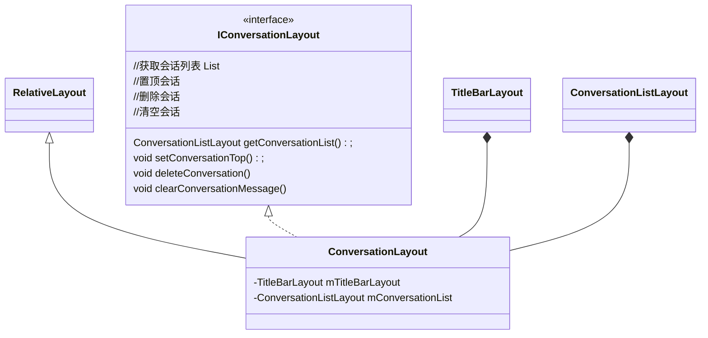
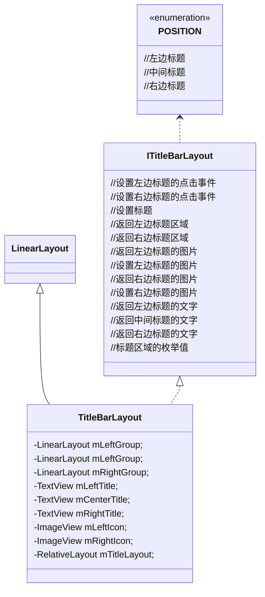
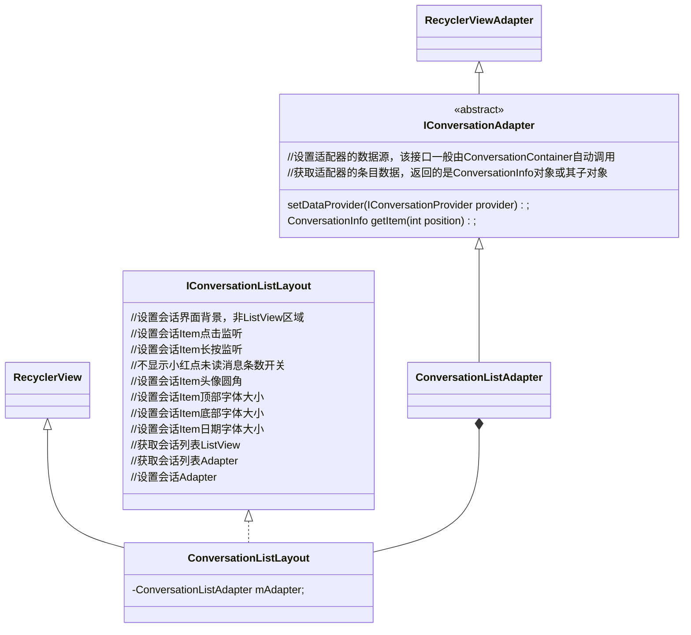

#### 会话列表UML

```mermaid
classDiagram
class RelativeLayout

class ConversationLayout{
	-TitleBarLayout mTitleBarLayout
	-ConversationListLayout mConversationList
}

class IConversationLayout{
	<<interface>>
	//获取会话列表 List
	//置顶会话
	//删除会话
	//清空会话
	ConversationListLayout getConversationList();
	void setConversationTop();
	void deleteConversation()
	void clearConversationMessage()
}


RelativeLayout <|-- ConversationLayout
IConversationLayout <|.. ConversationLayout
TitleBarLayout *-- ConversationLayout
ConversationListLayout *-- ConversationLayout
```

```mermaid
classDiagram
class LinearLayout

class TitleBarLayout{
    -LinearLayout mLeftGroup;
    -LinearLayout mLeftGroup;
	-LinearLayout mRightGroup;
    -TextView mLeftTitle;
    -TextView mCenterTitle;
    -TextView mRightTitle;
    -ImageView mLeftIcon;
    -ImageView mRightIcon;
    -RelativeLayout mTitleLayout;
}

class ITitleBarLayout{
	//设置左边标题的点击事件
	//设置右边标题的点击事件
	//设置标题
	//返回左边标题区域
	//返回右边标题区域
	//返回左边标题的图片
	//设置左边标题的图片
	//返回右边标题的图片
	//设置右边标题的图片
	//返回左边标题的文字
	//返回中间标题的文字
	//返回右边标题的文字
	//标题区域的枚举值
}

class POSITION{
	<<enumeration>>
	//左边标题
	//中间标题
	//右边标题
}
LinearLayout <|-- TitleBarLayout
ITitleBarLayout <|.. TitleBarLayout
POSITION <.. ITitleBarLayout
```

```mermaid
classDiagram
class RecyclerView
class ConversationListLayout{
	-ConversationListAdapter mAdapter;
}
class IConversationListLayout{
	//设置会话界面背景，非ListView区域
	//设置会话Item点击监听
	//设置会话Item长按监听
	//不显示小红点未读消息条数开关
	//设置会话Item头像圆角
	//设置会话Item顶部字体大小
	//设置会话Item底部字体大小
	//设置会话Item日期字体大小
	//获取会话列表ListView
	//获取会话列表Adapter
	//设置会话Adapter
}

class ConversationListAdapter
class IConversationAdapter{
	<<abstract>>
//设置适配器的数据源，该接口一般由ConversationContainer自动调用
//获取适配器的条目数据，返回的是ConversationInfo对象或其子对象
setDataProvider(IConversationProvider provider);
ConversationInfo getItem(int position);
}
class RecyclerViewAdapter

RecyclerViewAdapter <|--IConversationAdapter
IConversationAdapter <|--ConversationListAdapter


RecyclerView <|--ConversationListLayout
IConversationListLayout <|.. ConversationListLayout
ConversationListAdapter *-- ConversationListLayout
```

