MarkDown语法汇总

##### 1. 斜体和粗体

```toml
*斜体* 或 _斜体_
**粗体**
***斜体加粗体***
~~删除线~~
<u>下划线</u>
*** 分割线
~~~ 或 ``` 多行代码
` 单行代码 `
```

##### 2. 标题

```toml
# 标题1
## 标题2
### 标题3
...
###### 标题6
[toc]  自动生成目录
```

##### 3. 超链接

```toml
[百度搜索](www.baidu.com)
[USB官网](www.usb.org)
```

######  3.1 参考式

```toml
[id]: <http://example.com/>  "Optional Title Here"
链接内容定义的形式为：

    方括号（前面可以选择性地加上至多三个空格来缩进），里面输入链接文字
    接着一个冒号
    接着一个以上的空格或制表符
    接着链接的网址
    选择性地接着 title 内容，可以用单引号、双引号或是括弧包着
[foo]: http://example.com/  "Optional Title Here"
[foo]: http://example.com/  'Optional Title Here'
[foo]: http://example.com/  (Optional Title Here)
```

###### 3.2 自动链接式

```toml
<www.baidu.com>
```

##### 4. 锚点

```toml
## 0. 目录{#index}
跳转到[目录](#index)
```

##### 5. 列表

###### 5.1 无序列表

```toml
使用 * + - 都可以表示无序列表。当然还可以使用table键来创建多级列表
```

###### 5.2 有序列表

```toml
直接使用数字或者字母序号加上.空格
```

##### 6. 引用

```toml
在引用的文本前面加上>,可以加多重>
> this is a quote
```

##### 7. 插入图片

```toml
]  也可以直接复制粘贴的 
```

##### 8. 脚注

```toml
某些人用过才知道注释[^注释]的好
[^注释]: 注释是对陌生名词的解释
```

##### 9. LaTex公式

```toml
快捷键Ctrl+Shift+m  公式块但是因为和输入冲突了
使用 $$+回车代替
行内公式可以用$ $
```

##### 10.常用公式的代码

| 格式     |                             效果                             |                                                         语法 |
| -------- | :----------------------------------------------------------: | -----------------------------------------------------------: |
| 上标     | 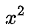 |                                                          x^2 |
| 下标     | 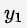 |                                                          y_1 |
| 左右分式 | 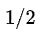 |                                                          1/2 |
| 上下分式 | 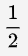 |                                                  \frac{1}{2} |
| 省略号   |  |                                                       \cdots |
| 开根号   | 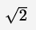 |                                                     \sqrt{2} |
| 矢量     | 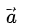 |                                                      \vec{a} |
| 积分     | 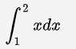 |                                              \int_{1}^{2}xdx |
| 极限     | 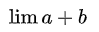 |                                                    \lim{a+b} |
|          | 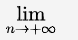 |                                   \lim_{n\rightarrow+\infty} |
| 累加     | 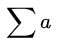 |                                                      \sum{a} |
|          | 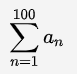 |                                        \sum_{n=1}^{100}{a_n} |
| 累乘     | 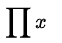 |                                                     \prod{x} |
|          | 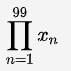 |                                        \prod_{n=1}^{99}{x_n} |
| 综合     | 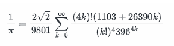 | \frac{1}{\pi}=\frac{2\sqrt{2}}{9801}\sum^{\infty}_{k=0}\frac{(4k)!(1103+26390k)}{(k!)^4396^{4k}} |

