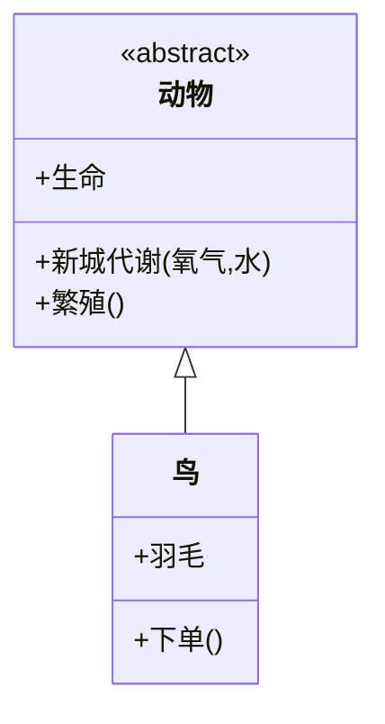
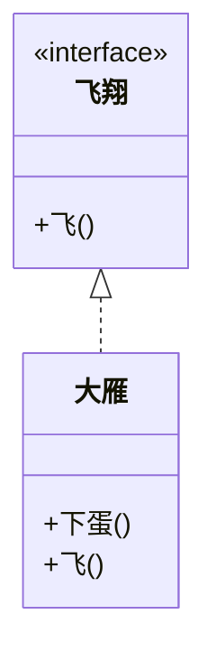
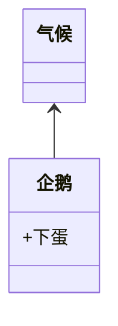
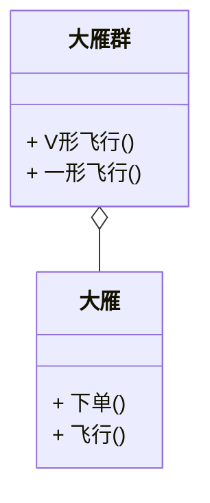
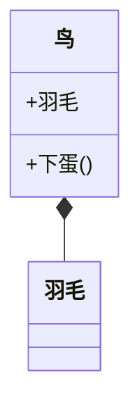
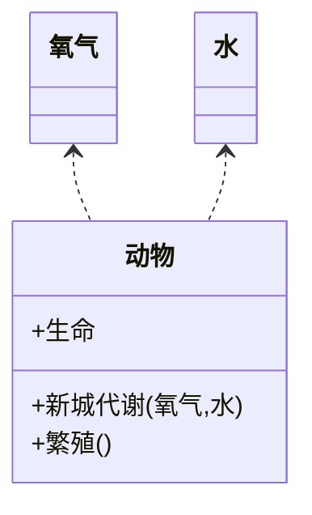

#### Mermaid 绘制类图使用详解

##### 类与类之间的关系

在UML类图中常见的有以下几种关系：

+ 泛化(**Generalization**)

+ 关联(**Association**) 
+ 聚合(**Aggregation**)
+ 组合(**Composition**)
+ 依赖(**Dependency**)


##### 泛化(Generalization)

泛化表示类与类之间的继承关系、接口与接口之间的继承关系，或类与接口的实现关系

```none
（1）继承
表示方法：空心箭头 + 实线(UML)；mermaid: <|--
示例：鸟类继承抽象类动物
```




```none
（2）实现　　
　表示方法：空心箭头 + 虚线(UML); mermaid：<|..
　示例：大雁需要飞行，就需要实现飞的接口
```




##### 关联(Association) 

对于两个独立的对象，当一个对象的实例与另一个对象的特定实例存在固定的对应关系时，这两个对象之间构成关联关系

```none
表示方法：用实线箭头表示(UML); mermaid: <--
示例：企鹅需要'知道'气候变化，需要'了解'气候规律。当一个类'知道'另一个类时可以用关联
```



##### 聚合(Aggregation)

表示一种弱的拥有关系，即has-a的关系，体现的是A对象可以包含B对象，但B类不是A类的一部分。两个对象有各自的生命周期

```
表示方法：空心菱形 + 实线箭头(UML); mermaid: o--
示例：每一只大雁都属于一个大雁群，一个大雁群可以有多只大雁。当大雁死去后大雁群并不会消失，两个对象生命周期不同。
```



##### 组合(Composition)

组合是一种强的拥有关系，即contains-a的关系，体现了严格的部分和整体的关系，部分和整体的生命周期一样

```
表示方法：实心菱形 + 实线箭头(UML); mermaid: *--
示例：鸟和翅膀就是组合关系，因为它们是部分和整体的关系，并且翅膀和鸟的生命周期是相同的。
```



##### 依赖(Dependency)

对于两个独立的对象，当需要在一个对象中构造另一个对象的实例，用作方法的调用者或方法的形参时，两者构成关联关系

```none
表示方法：用虚线箭头表示(UML); mermaid: <..
示例：动物依赖氧气和水。调用新陈代谢方法需要氧气类与水类的实例作为参数
```



