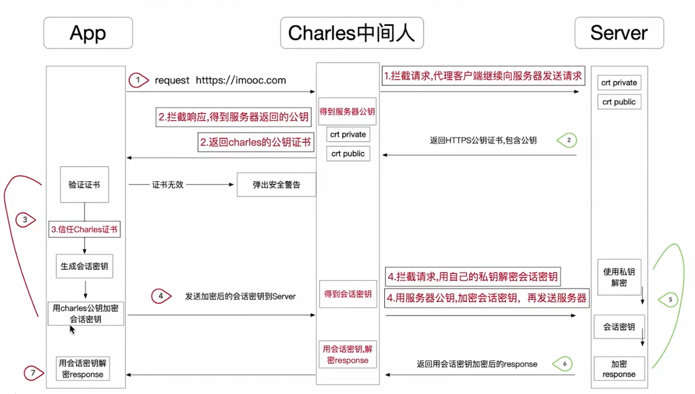

#### 网络抓包

##### 抓包常用工具

* wireshark：侧重于TCP,UDP 传输层,HTTP/HTTPS也能抓包,但不能解密HTTPS报文。
* fiddler：支持对HTTP/HTTPS协议，篡改请求入参，篡改请求断电重发，弱网络模拟，只支持windows
* charles：基本功能同上，全平台支持，界面简洁，操作简单

##### Charles抓包原理

1. 拦截请求，代理client向server发送请求

2. 拦截server响应，拿到server返回的公钥，并返回自己的公钥证书。目的是为了接下来的流程中加密会话密钥

3. client需要安装charles证书，并添加信任，否则会报证书无效错误。

   client生成随机数(会话密钥)，并使用charles公钥加密发送到server

4. 再次拦截请求，用自己的私钥解密会话密钥，并使用前面拿到的server公钥加密会话密钥，发送到server

5. server使用自己的私钥解密会话密钥

6. 使用会话密钥加密response，并返回

7. 再次拦截响应，使用会话密钥解密response，展示明文，从而达到https抓包的目的

