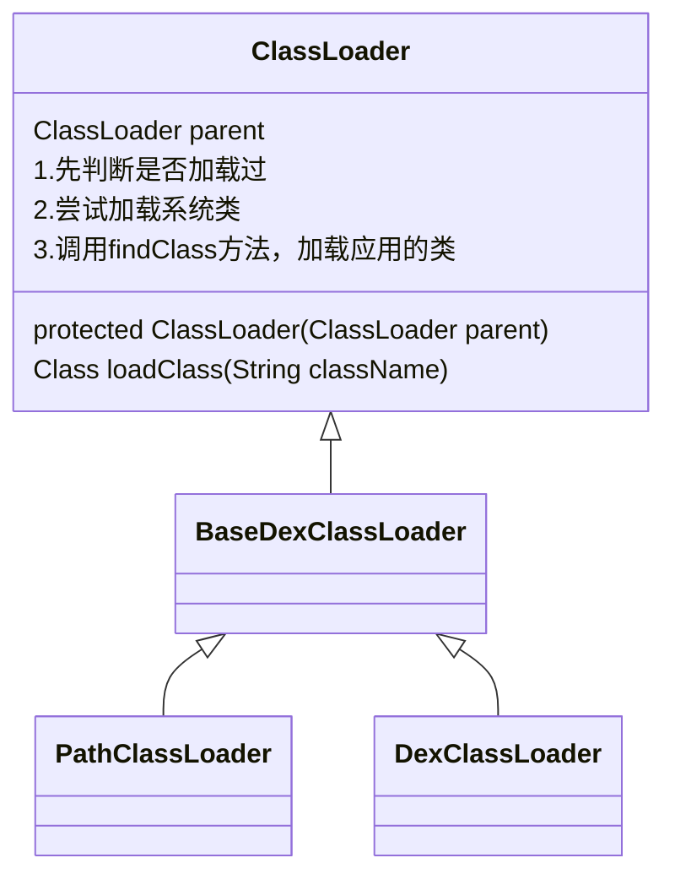

#### Android中主要的类加载器

* `PathClassLoader`:复杂的加载系统类和应用程序的类，通常用来加载已安装的`apk`的`dex`文件，实际上外部存储的`dex`文件也能加载
* `DexClassLoader`:可以加载`dex`文件以及包含`dex`的压缩文件（`apk,dex,jar,zip`）
* `BaseDexClassLoader`:实现应用层类文件的加载，而真正的加载委托给`PathClass`来完成

#### 1.双亲委派的作用？

> * 防止同一个`.class`文件重复加载
> * 对于任意一个类确保在虚拟机中的唯一性。由加载它的加载器和这个类的全类名一同确立在Java虚拟机中的唯一性
> * 保证系统类`.class`文件不能被篡改。通过委托方式可以保证系统类的加载逻辑不被篡改

