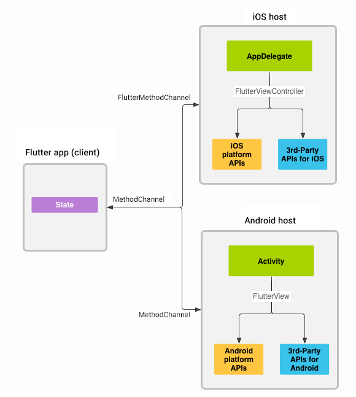

#### flutter的channel通信方式有三种方式

`MethodChannel`

* flutter和native端相互调用，调用后返回结果
* 可以由native端主动调用，也可以由flutter主动调用，属于双向通信
* 此种方式最为常见，native端调用需要在主线程中执行

`BasicMessageChannel`

* 用于使用指定编码器对消息进行编码和解码
* 属于双向通信，可以由native端主动调用，也可以fultter主动调用

`EventChannel`

* 用于数据流（event stream）的通信，native端主动发送数据给flutter
* 通常用于状态端监听，比如网络变化、传感器数据等

