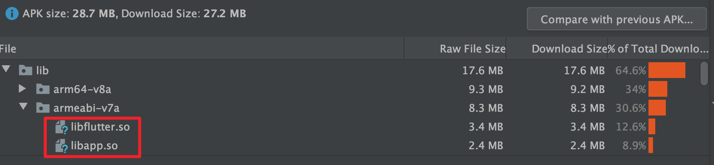
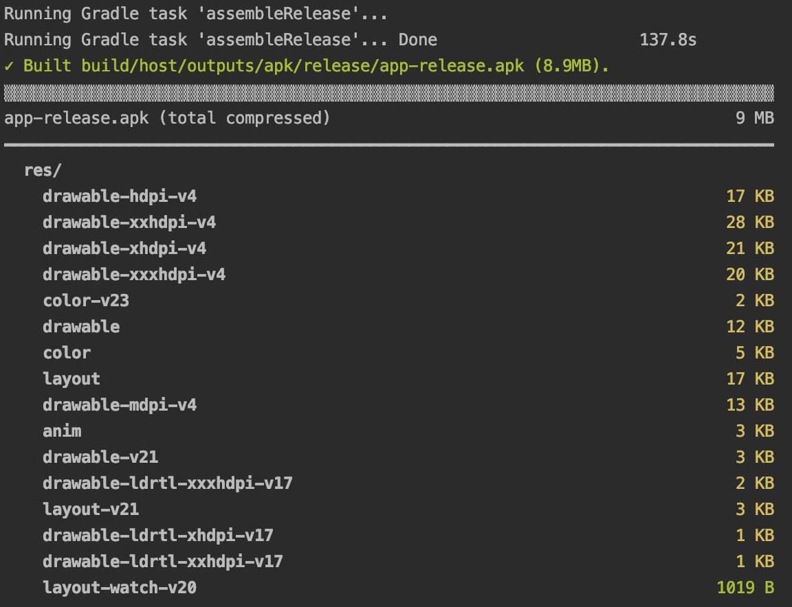
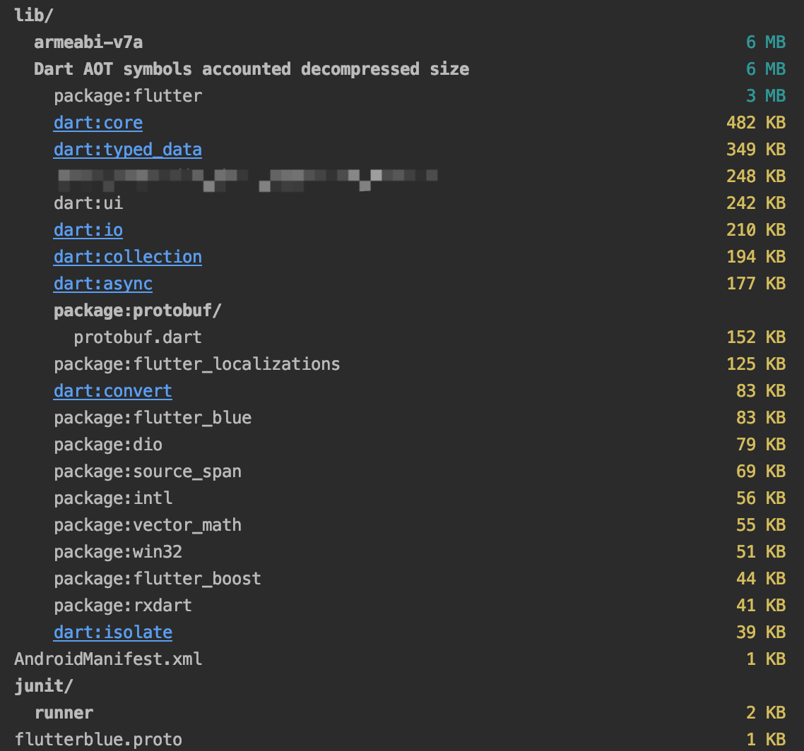
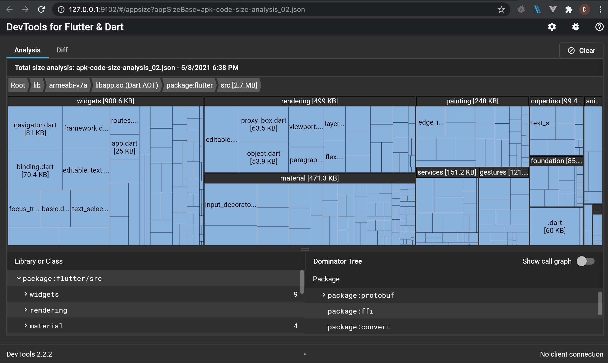

#### 应用程序大小

flutter的体积增长主要来自以下几个方面

* flutter库
* dart库
* 应用代码，三方库
* 资源文件



编译打包之后，可以看到新增了 libflutter.so 和 libapp.so，这两个玩意一个是 Flutter 库，一个是你自身代码以及引入的三方库

#### 包体积优化

主要优化的思路有一下几点

* 去除不需要支持的架构

这个比较简单，只需要在` gradle` 配置中进行配置就行

```  groovy
defaultConfig {
  ...
  ndk {
      abiFilters 'armeabi-v7a', "arm64-v8a"
  }
}
```

* 删除没有使用的资源文件，对图片进行压缩
* 删除没有使用的三方库
* 优化代码
* 混淆
* 代码检查是否有偏大文件

这里主要参考： https://flutter.dev/docs/perf/app-size

在 Flutter 1.22 以及 DevTools 0.9.1 版本后，支持release版本代码大小测量，可以很直观看到主要大小消耗在什么地方

这个只需要在编译时加上 `--analyze-size` 标识即可

- flutter build apk –analyze-size
- flutter build appbundle –analyze-size
- flutter build ios –analyze-size
- flutter build linux –analyze-size
- flutter build macos –analyze-size
- flutter build windows –analyze-size





该命令主要有两个作用：

- 在编译 Dart 代码时会记录 Dart packages 中代码大小的使用情况。
- 输出应用大小相关的具体细节，并将结果最终保存在 -code-size-analysis_.json 文件中供我们使用 DevTools 做进行分析。

可以通过以下命令利用 DevTools 查看(如已经安装可忽略第一条)：

```dart
flutter pub global activate devtools;
flutter pub global run devtools --appSizeBase=apk-code-size-analysis_02.json
```



对于比较大的文件，可以自行分析该如何进一步优化
